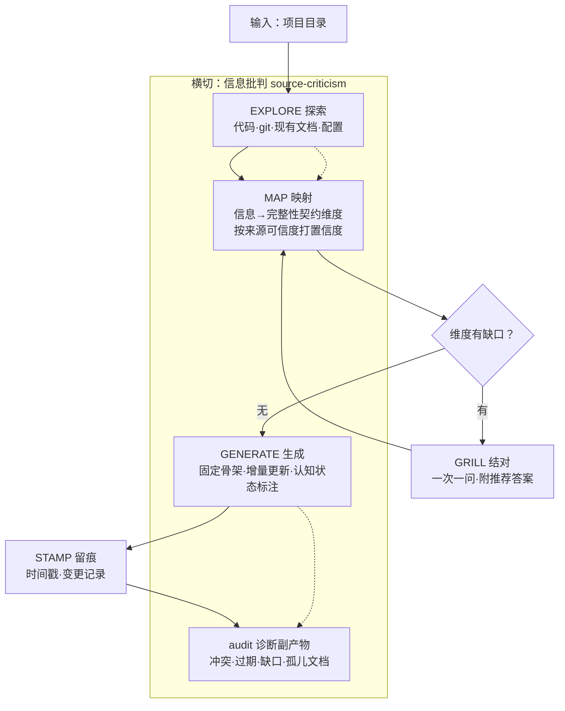
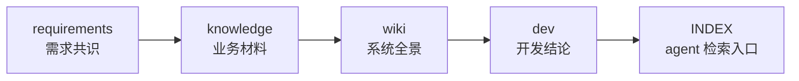

# doc-layers

> 一个 Claude Code Skill：按四层知识结构，为任意项目生成并维护文档——既给人看，也给 AI agent 读。

四层文档由不同性质的知识构成（业务全景、需求共识、业务材料、开发结论），各有受众与来源。doc-layers 用一个 skill 的若干子命令统一生成，并以"信息批判"保证内容准确、不过期。

---

## 解决什么问题

项目形态各异（全栈服务、Dify DSL 应用、CLI/MCP 服务、Skill），但文档需求是共通的：

- **业务看不懂代码** —— 需要一份非技术的系统全景。
- **需求随成品漂移** —— 当初的共识和取舍散落在聊天记录里，没人还原得出。
- **业务材料散乱** —— 规章制度、业务规则等原始材料无索引、无法被检索引用。
- **开发结论流失** —— 踩过的坑、否定过的方案，下一个人重新踩一遍。
- **AI agent 找不到项目上下文** —— coding agent 干活时缺一份"知识在哪"的入口，只能反复读代码。

市面工具大多只覆盖其中一层（如 DeepWiki 做技术 wiki、Mintlify 做 API 文档），且普遍是 **code-first**——只从代码生成，丢掉了需求意图和业务知识。doc-layers 是 **requirement + business first**：保留需求原文与业务材料，再向下推导技术文档。

更关键的是一条被实证的风险：**自动生成的文档若不准确、会过期，比没有文档更糟**——它看起来权威，却会误导人和 agent（[arXiv:2602.11988](https://arxiv.org/abs/2602.11988) 实测：臃肿/过期的 agent 上下文文件反而降低任务成功率）。所以 doc-layers 把"信息批判"做成一等公民。

---

## 四层知识结构

理论锚点是 **CoALA**（[Sumers et al., TMLR 2024](https://arxiv.org/abs/2309.02427)）的 agent 记忆架构——它把 agent 的长期记忆分为 episodic / semantic / procedural 三类。四层文档与之对应：

| 子命令 | CoALA 长期记忆 | 产出 | 本质 | 受众 |
|---|---|---|---|---|
| `wiki` | Semantic | `docs/wiki.md` | 系统全景，"能做什么" | 所有人（含业务） |
| `requirements` | Episodic | `docs/requirements.md` | 需求共识 + 开发计划（ADR 性质） | PM + 开发 |
| `knowledge` | Semantic | `docs/knowledge/knowledge.md` | 业务原始材料的整理与索引 | 技术 + 业务 |
| `dev` | Procedural | `docs/dev.md` | 开发推断与实践结论 | 开发 + 维护者 |
| `index` | 检索入口 | `docs/INDEX.md` | 给 coding agent 的四层导航 | AI agent |

> `index` 不是 CoALA 的 Working Memory（那是 agent 运行时的活跃 context，文档工具不生产它）。它是长期记忆的**检索入口**，优化 agent 装填上下文的路径。

---

## 借鉴的方法论

doc-layers 的每个设计决策都锚定在成熟方法论上，而非凭感觉：

| 方法论 | 来源 | 用在哪 |
|---|---|---|
| **CoALA** 记忆四层 | [arXiv:2309.02427](https://arxiv.org/abs/2309.02427)（Princeton/CMU, TMLR 2024） | 文档的四层划分 |
| **Diátaxis** 文档四象限 | [diataxis.fr](https://diataxis.fr)（Ubuntu/GNOME/NumPy 采纳） | "固定骨架 + 自由内容"的写法 |
| **渐进式披露** | [Anthropic Agent Skills](https://www.anthropic.com/engineering/equipping-agents-for-the-real-world-with-agent-skills) | SKILL.md 精简、细节按需加载 |
| **信息批判**（来源分级 / 矛盾处理 / 认知状态标注） | NATO Admiralty Code、史学史料批判、情报分析 ACH、三角验证、[LLM 知识冲突研究](https://aclanthology.org/2024.emnlp-main.486.pdf) | source-criticism 四准则 |
| **AGENTS.md** 事实标准 | [Agentic AI Foundation](https://www.linuxfoundation.org/press/linux-foundation-announces-the-formation-of-the-agentic-ai-foundation)（OpenAI/Anthropic/Block，Linux Foundation） | INDEX.md 的定位与边界 |
| **精简上下文**实证 | [arXiv:2602.11988](https://arxiv.org/abs/2602.11988)（ETH Zurich） | INDEX.md 的行数硬约束 |

**信息批判四准则**（[source-criticism.md](skill/doc/references/source-criticism.md)）是质量的核心保证——从成熟学科提炼，并刻意砍掉了过度设计（完整 ACH 八步、Admiralty 双轴打分、Wang&Strong 全维度、W3C PROV）：

1. **来源可信度排序** —— 代码是一手事实，文档是对事实的解读；解读可能错、可能过期。
2. **矛盾处理** —— 发现冲突绝不静默选一个，标 `[过期]`/`[冲突]` 或交人裁决。
3. **认知状态标注** —— 区分 `[事实]`/`[推断]`/`[待确认]`/`[缺口]`，推断不伪装成事实。
4. **打破 LLM 先验** —— 项目用了非主流实现时，记录实际行为，不"纠正"成训练数据里的标准做法。

---

## 工作流程

每个文档层都走同一套循环：**先穷尽自动探索，仅在信息有缺口时才向人提问**（把人当作补全 context 的工具，而非每次从头问）。



层间存在依赖顺序，`all` 模式按此生成（每层可独立触发，上游存在则自动引用）：



**audit** 是生成流程的副产物，不是单独命令：source-criticism 在探索阶段本就会发现跨来源（代码 / git / 文档 / 规范文件）的冲突、过期、缺口，audit 把这些汇总成一份"信息健康诊断"报告——产出判断，不产出文档。

---

## 安装

```bash
git clone <repo> && cp -r doc-layers/skill/doc ~/.claude/skills/doc
```

## 使用

在目标项目里：

```
/doc wiki            # 业务全景
/doc requirements    # 还原/固化需求共识
/doc knowledge       # 整理业务材料（先放进 docs/knowledge/raw/ 或在 sources.yaml 列 URL）
/doc dev             # 开发推断与实践结论
/doc index           # 给 coding agent 的检索入口
/doc all             # 按依赖顺序全部生成
```

工具自动判断项目类型，无需声明。文档默认存项目内 `docs/`，随 git 提交。

---

## Dogfooding

本项目自身的文档就用四层结构写成——既是规格，也是范例：

- [INDEX.md](docs/INDEX.md) —— agent 检索入口
- [requirements.md](docs/requirements.md) —— 需求共识与全部设计决策（D1–D12）
- [wiki.md](docs/wiki.md) —— 业务全景
- [dev.md](docs/dev.md) —— 设计取舍、实测结论、被否定的方案

经四种项目形态实测迭代：前端工具、Python 工具、MCP 服务、Dify DSL 工具。

## 结构

```
skill/doc/
├── SKILL.md                    路由 + 执行循环 + audit
└── references/                 渐进加载
    ├── methodology.md          完整性契约 + 缺口驱动 grill
    ├── source-criticism.md     信息批判四准则
    ├── layer-{wiki,requirements,knowledge,dev,index}.md
    ├── audit-report.md         诊断副产物规范
    └── doc-conventions.md      agent 友好文档规范
```

## License

MIT
