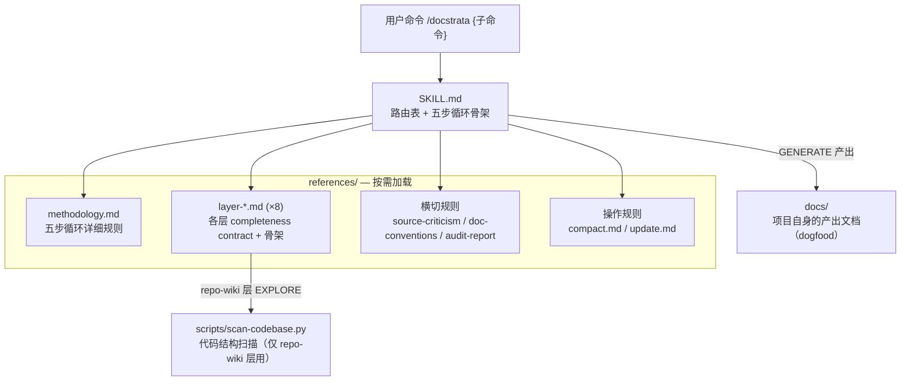

# Repo Wiki — docstrata

> 代码库索引：docstrata 的文件组织、模块关系、数据流和架构约束。面向 coding agent 和开发者。

last-verified: 2026-08-07 | scan-version: 2026-08-07T06:46:19Z

## System Overview

docstrata 是一个 Agent Skill 项目，不是传统应用。"代码"主要是 Markdown 指令文件（告诉 LLM agent 怎么执行每个子命令）和一个 Python 扫描脚本。没有运行时服务、没有 API endpoint、没有构建产物。

项目交付物是 `skill/docstrata/` 目录——通过 `npx skills add` 安装到用户的 agent 环境中。

## Technology Stack

| 维度 | 值 |
|---|---|
| 主要语言 | Markdown（82%）— skill 指令和项目文档 |
| 辅助语言 | Python（18%）— `scan-codebase.py` 扫描脚本 |
| 分发标准 | [Agent Skills](https://agentskills.io)（兼容 Claude Code / Cursor / Gemini CLI / Codex / OpenCode） |
| 包管理 | `npx skills add linhai0872/docstrata` |
| Python 依赖 | 零外部依赖（纯标准库） |

## Architecture



核心架构原则：**渐进式披露**（Anthropic Agent Skills 规范）。agent 先读 SKILL.md（70 行，路由 + 骨架），执行某层时再加载对应的 reference（60-180 行），不一次性全量加载。

## Modules

按功能职责分为 4 个区域：

### skill/docstrata/ — Skill 核心（source of truth）

| 文件 | 行数 | 职责 |
|---|---|---|
| `SKILL.md` | 70 | 入口：routing table + 五步循环骨架 + 渐进加载指针 |
| `references/methodology.md` | 137 | 五步循环的完整规则（EXPLORE/MAP/GRILL/GENERATE/STAMP） |
| `references/layer-repo-wiki.md` | 184 | repo-wiki 层：completeness contract + JSON 规范 + section 骨架 |
| `references/doc-conventions.md` | 125 | 写作规范：两段式、向上指针、anti-slop、时间戳 |
| `references/compact.md` | 106 | compact 操作：毕业门槛、保真要求、CONTEXT.md 回收 |
| `references/update.md` | 97 | update 操作：变更检测、影响面映射、刷新逻辑 |
| `references/source-criticism.md` | 72 | 信息批判四准则 |
| `references/layer-*.md` (×6) | 64-80 each | prd/requirements/knowledge/wiki/dev/index 各层 contract |
| `references/audit-report.md` | 71 | 诊断副产物格式 |

### scripts/ — 可执行工具

| 文件 | 行数 | 职责 |
|---|---|---|
| `scan-codebase.py` | 471 | 代码结构扫描：目录树、import 解析、模块边界、PageRank、技术栈检测。输出 JSON。零外部依赖、零 LLM 调用。 |

### docs/ — 项目自身文档（dogfood）

docstrata 用自己的分层结构记录自己的 context。这些文件既是产品文档，也是 skill 功能的实测样本。

| 文件 | 层 | 行数 |
|---|---|---|
| `prd.md` | 产品意图 | 66 |
| `requirements.md` | 需求共识（D1-D25） | 258 |
| `wiki.md` | 系统全景 | 72 |
| `repo-wiki.md` | 代码库索引（本文件） | — |
| `dev.md` | 工程结论 | 196 |
| `INDEX.md` | 文档导航 + context triggers | 35 |

### 根目录 — 开源门面

| 文件 | 职责 |
|---|---|
| `README.md` | 中文主 README（面向 GitHub） |
| `README_EN.md` | 英文 README |
| `LICENSE` | MIT |
| `docstrata-logo.svg` | Logo |
| `skills-lock.json` | 本地 skill 安装锁文件 |

## Data Flow

docstrata 的"数据流"是指令加载流，不是运行时数据流：

```
1. 用户说 "/docstrata wiki"
2. Agent 读 SKILL.md → 匹配路由表 → wiki
3. Agent 读 references/methodology.md → 获取五步循环规则
4. Agent 读 references/layer-wiki.md → 获取 wiki 层的 completeness contract + 骨架
5. Agent 执行 EXPLORE → 读项目文件
6. Agent 执行 MAP → 打置信度
7. Agent 执行 GRILL → 问用户（或跳过）
8. Agent 执行 GENERATE → 产出 docs/wiki.md
9. Agent 执行 STAMP → 写时间戳
```

repo-wiki 层多一步：EXPLORE 阶段调用 `scan-codebase.py` 获取结构化 JSON，作为 GENERATE 的输入。

update 的数据流：`git diff` + `last-verified` 时间戳 → 影响面映射 → 选择性触发上述流程。

## API Surface

对外接口是 10 个子命令（通过自然语言触发）：

| 子命令 | 触发词 | 类型 |
|---|---|---|
| `prd` | "产品意图/定位/roadmap" | 生成层 |
| `requirements` | "需求/决策/还原需求" | 生成层 |
| `knowledge` | "业务材料/知识库" | 生成层 |
| `wiki` | "全景/系统介绍" | 生成层 |
| `repo-wiki` | "代码结构/代码库索引" | 生成层 |
| `dev` | "开发结论/踩坑" | 生成层 |
| `index` | "文档导航/索引" | 派生层 |
| `compact` | "收缩/精简/compact" | 横切操作 |
| `update` | "更新/刷新/同步/update" | 横切操作 |
| `all` | "全部文档" | 批量 |

## Configuration

| 文件 | 作用 |
|---|---|
| `skills-lock.json` | 本地安装的 skill 版本锁定（.gitignore） |
| `.agents/skills/docstrata/` | symlink → `../../skill/docstrata/`，让项目自身可以 dogfood |

无环境变量、无 .env、无构建配置。

## Architecture Constraints

- **scan-codebase.py 不引入 LLM 调用**：纯静态分析，保持零 token 成本。LLM 只在 GENERATE 阶段介入。
- **references/ 不互相 import**：每个 reference 文件自包含，agent 按需加载单个文件，不存在"要理解 A 必须先读 B"的隐式依赖。methodology.md 是唯一被所有层共享的规则文件。
- **docs/ 是产出不是源**：`skill/docstrata/` 是 source of truth，`docs/` 是 skill 产出的文档。修改 skill 行为改 `skill/`，修改项目文档改 `docs/`。
- **.agents/ 是 symlink 不是副本**：避免两份文件漂移。

## 变更记录
- 2026-08-07 首次生成（docstrata 自身 dogfood）
